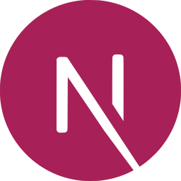

<p align="center">
<h1 align="center" style="font-size: 64px;">NextJS Boilerplate</h1>
</p>

## 🚀 Technologies

- [Next.js](https://nextjs.org)
- [TypeScript](https://www.typescriptlang.org)
- [EditorConfig](https://editorconfig.org)
- [ESLint](https://eslint.org)
- [Prettier](https://prettier.io)
- [lint-staged](https://github.com/okonet/lint-staged)
- [Husky](https://typicode.github.io/husky)
- [Jest](https://jestjs.io/)
- [React Testing Library](https://testing-library.com/)
- [styled-components](https://styled-components.com/)

## 🔥️ Starting the project

Create a new application using `create next-app` with the `-e | --example` flag pointing to this repository's _url_, like so:

```bash
yarn create next-app --example https://github.com/guilhermecosta7/nextjs-boilerplate
```

> **Tip:** You can find `create next-app`'s documentation at [https://nextjs.org/docs/api-reference/create-next-app](https://nextjs.org/docs/api-reference/create-next-app).

### Alternative setup

You can also click on the `Use this template` button.

After that, clone the repository that was created on your account and follow the steps below:

```bash
# Installing project dependencies
yarn install && yarn husky install

# Starting the project
yarn dev
```

